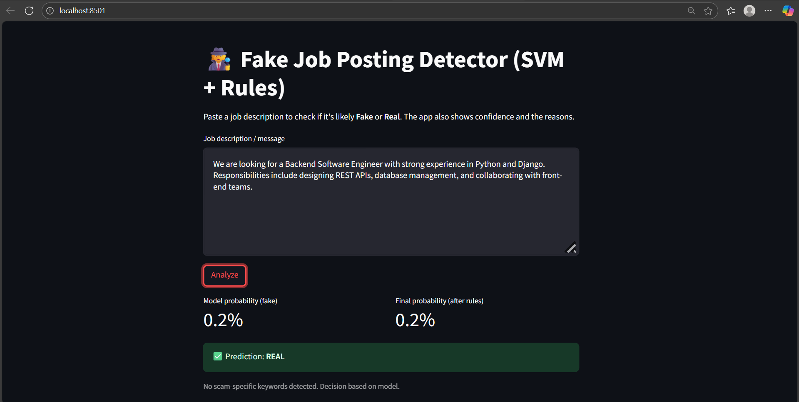
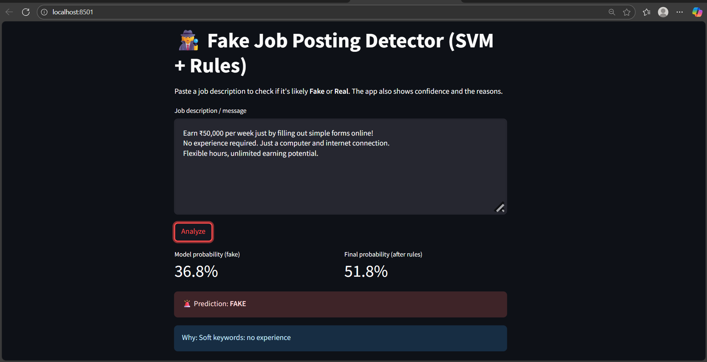

# 🕵️ Fake Job Posting Detection

A Machine Learning and Natural Language Processing (NLP) based application that detects whether a job posting is **genuine** or **fraudulent**. The project uses advanced text preprocessing, TF-IDF feature engineering, and a Linear Support Vector Machine (SVM) model to classify job advertisements and help job seekers identify potential scams.

---

## 📌 Overview

Online job portals have become a common target for fraudulent job advertisements that mislead job seekers and collect sensitive information. Manual verification of job postings can be time-consuming and unreliable.

This project automates the detection process using Machine Learning and NLP techniques. Users can enter job posting details through an interactive Streamlit web application and instantly receive a prediction indicating whether the posting is likely to be real or fake.

---

## 🚀 Features

* Detects fake and genuine job postings
* Interactive Streamlit web application
* NLP-based text preprocessing
* Real-time predictions
* Fraud keyword detection
* Probability-calibrated classification model
* User-friendly interface

---

## 📊 Dataset

This project uses the **Fake Job Postings Dataset**, which contains both genuine and fraudulent job advertisements.

### Features Used

* Job Title
* Job Description
* Requirements
* Fraudulent Label (Target Variable)

The textual features are combined and processed to create a unified representation for classification.

---

## 🛠️ Technology Stack

### Programming Language

* Python

### Machine Learning

* Scikit-learn
* Linear Support Vector Machine (Linear SVC)

### Natural Language Processing

* NLTK
* TF-IDF Vectorization

### Data Processing

* Pandas
* NumPy

### Model Persistence

* Joblib

### Web Application

* Streamlit

---

## ⚙️ Project Workflow

1. Load job posting dataset
2. Handle missing values
3. Combine title, description, and requirements fields
4. Clean and preprocess textual data
5. Remove stopwords while preserving important fraud-related keywords
6. Generate TF-IDF word-level features
7. Generate TF-IDF character-level features
8. Combine feature vectors
9. Train Linear SVM classifier
10. Calibrate prediction probabilities
11. Optimize classification threshold
12. Deploy model using Streamlit

---

## 🧠 Machine Learning Approach

### Text Preprocessing

The following preprocessing steps were applied:

* Convert text to lowercase
* Remove special characters and punctuation
* Remove unnecessary stopwords
* Preserve domain-specific fraud indicators such as:

  * Visa
  * Deposit
  * Fee
  * Sponsorship
  * WhatsApp
  * Telegram

### Feature Engineering

Two TF-IDF representations were used to improve detection performance:

#### Word-Level TF-IDF

* N-grams: 1–2
* Maximum Features: 20,000

#### Character-Level TF-IDF

* Character N-grams: 3–5
* Maximum Features: 10,000

The combined feature representation captures both meaningful words and suspicious text patterns commonly found in fraudulent job postings.

### Classification Model

* Linear Support Vector Machine (Linear SVC)
* Class balancing enabled
* Probability calibration using Sigmoid Calibration
* Threshold optimization for improved fraud detection

---

## 🔍 Fraud Detection Enhancements

In addition to machine learning predictions, the system uses fraud-related indicators commonly found in suspicious job advertisements, including:

* Registration Fee
* Processing Fee
* Security Deposit
* Application Fee
* Training Fee
* Pay First
* Earn Daily
* WhatsApp
* Telegram
* Visa Sponsorship Guaranteed

These indicators help strengthen the model's ability to identify potentially fraudulent postings.

---

## 📂 Project Structure

```text
Fake-Job-Detector/
│
├── data/
│   └── fake_job_postings.csv
│
├── outputs/
│   └── fake_job_detector_bundle.joblib
│
├── app.py
├── main.py
├── requirements.txt
├── README.md
├── Screenshot1.png
└── Screenshot2.png
```

## ▶️ Installation

### Clone the Repository

```bash
git clone https://github.com/your-username/fake-job-detector.git
cd fake-job-detector
```

### Install Dependencies

```bash
pip install -r requirements.txt
```

### Run the Application

```bash
streamlit run app.py
```

The application will open in your browser at:

```text
http://localhost:8501
```

---

## 🌐 Live Demo

🔗 https://fake-job-detector-07.streamlit.app/

---

## 📸 Application Screenshots

### Prediction Result 1



### Prediction Result 2



---

## 🎯 Future Improvements

* Improve model performance with larger datasets
* Support multilingual job postings
* Implement deep learning-based NLP models
* Add explainable AI (XAI) features
* Containerize using Docker
* Deploy on cloud platforms
* Add confidence score visualization

---

## 💡 Real-World Applications

* Online Job Portals
* Recruitment Platforms
* HR Screening Systems
* Employment Fraud Detection
* Career Guidance Platforms

---

## 👩‍💻 Author

**Asvithaa K**

Aspiring Data Scientist | Machine Learning Enthusiast | NLP Explorer

---

## ⭐ Support

If you found this project useful, consider giving it a star on GitHub.
